# Setting up Airbyte Data Pipelines Lab

- Configuring Data Pipelines with [Airbyte](https://airbyte.com/)
- Deploying Infrastructure as Code with [Terraform](https://www.terraform.io/) and [Yandex.Cloud](https://cloud.yandex.com/en-ru/)
- Instant development with [Github Codespaces](https://docs.github.com/en/codespaces)
- Assignment checks with [Github Actions](https://github.com/features/actions)

## Lab plan

- [Fork this repository](https://docs.github.com/en/get-started/quickstart/fork-a-repo)
- [Configure Developer Environment](#1-configure-developer-environment)
    - Start with GitHub Codespaces:
    - Use devcontainer (locally)
- [Deploy Infrastructure to Yandex.Cloud with Terraform](#2-deploy-infrastructure-to-yandexcloud-with-terraform)
    - Get familiar with Yandex.Cloud web UI
    - Configure `yc` CLI
    - Populate `.env` file, Set environment variables
    - Deploy using Terraform: VM with Airbyte installed, S3 Bucket, Clickhouse
- [Access Airbyte](#3-access-airbyte)
    - Get VM's public IP
    - Log into web UI
- [Configure Data Pipelines](#4-configure-data-pipelines)
    - Configure Postgres Source
    - Configure Clickhouse Destination, S3 Destination
    - Sync data to Destinations
- [Test your Pipeline with dbt](#5-test-your-pipeline-with-dbt)
    - Run tests with your own created Clickhouse cluster
    - Open PR and trigger automated testing with Github Actions
- [Delete cloud resources](#delete-cloud-resources)

## 1. Configure Developer Environment

You have got several options to set up:
 
<details><summary>Start with GitHub Codespaces:</summary>
<p>


</p>
</details>

<details><summary>Use devcontainer (locally)</summary>
<p>

1. Install [Docker](https://docs.docker.com/desktop/#download-and-install) on your local machine.

1. Install devcontainer CLI:

    Open command palette (CMD + SHIFT+ P) type *Install devcontainer CLI*

    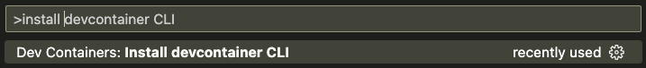

1. Next build and open dev container:

    ```bash
    # build dev container
    devcontainer build .

    # open dev container
    devcontainer open .
    ```

</p>
</details>

Verify you are in a development container by running commands:

```bash
terraform -v

yc --version

dbt --version
```

If any of these commands fails printing out used software version then you are probably running it on your local machine not in a dev container!

## 2. Deploy Infrastructure to Yandex.Cloud with Terraform

1. Get familiar with Yandex.Cloud web UI

    We will deploy:
    - [Yandex Compute Cloud](https://cloud.yandex.com/en/services/compute)
    - [Yandex Object Storage](https://cloud.yandex.com/en/services/storage)
    - [Yandex Managed Service for ClickHouse](https://cloud.yandex.com/en/services/managed-clickhouse)
    
    

1. Configure `yc` CLI: [Getting started with the command-line interface by Yandex Cloud](https://cloud.yandex.com/en/docs/cli/quickstart#install)

    ```bash
    yc init
    ```

1. Populate `.env` file

    `.env` is used to store secrets as environment variables.

    Copy template file [.env.template](./.env.template) to `.env` file:
    ```bash
    cp .env.template .env
    ```

    Open file in editor and set your own values.

    > ❗️ Never commit secrets to git    

1. Set environment variables:

    ```bash
    export YC_TOKEN=$(yc iam create-token)
    export YC_CLOUD_ID=$(yc config get cloud-id)
    export YC_FOLDER_ID=$(yc config get folder-id)
    export TF_VAR_folder_id=$(yc config get folder-id)
    export $(xargs < .env)

    ## DEBUG
    # export TF_LOG_PATH=./terraform.log
    # export TF_LOG=trace
    ```

1. Deploy using Terraform

    Configure YC Terraform provider:
    
    ```bash
    cp terraformrc ~/.terraformrc
    ```

    Get familiar with Cloud Infrastructure: [main.tf](./main.tf) and [variables.tf](./variables.tf)

    ```bash
    terraform init
    terraform validate
    terraform fmt
    terraform plan
    terraform apply
    ```

    Store terraform output values as Environment Variables:

    ```bash
    export CLICKHOUSE_HOST=$(terraform output -raw clickhouse_host_fqdn)
    export DBT_HOST=${CLICKHOUSE_HOST}
    export DBT_USER=${CLICKHOUSE_USER}
    export DBT_PASSWORD=${TF_VAR_clickhouse_password}
    ```

    [EN] Reference: [Getting started with Terraform by Yandex Cloud](https://cloud.yandex.com/en/docs/tutorials/infrastructure-management/terraform-quickstart)
    
    [RU] Reference: [Начало работы с Terraform by Yandex Cloud](https://cloud.yandex.ru/docs/tutorials/infrastructure-management/terraform-quickstart)

## 3. Access Airbyte

1. Get VM's public IP:

    ```bash
    terraform output -raw yandex_compute_instance_nat_ip_address
    ```

2. Lab's VM image already has Airbyte installed

    <details><summary>I have prepared VM image and made it publicly available:</summary>
    <p>

    https://cloud.yandex.com/en-ru/docs/compute/concepts/image#public

    ```bash
    yc resource-manager cloud add-access-binding y-cloud \
        --role compute.images.user \
        --subject system:allAuthenticatedUsers
    ```

    TODO: define VM image with **Packer** so that everyone is able to build his own image

    </p>
    </details>


    <details><summary>However if you'd like to do it yourself:</summary>
    <p>

    ```bash
    ssh airbyte@{yandex_compute_instance_nat_ip_address}

    sudo mkdir airbyte && cd airbyte
    sudo wget https://raw.githubusercontent.com/airbytehq/airbyte-platform/main/{.env,flags.yml,docker-compose.yaml}
    sudo docker-compose up -d
    ```

    </p>
    </details>

3. Log into web UI at {yandex_compute_instance_nat_ip_address}:8000

    With credentials:

    ```
    airbyte
    password
    ```

    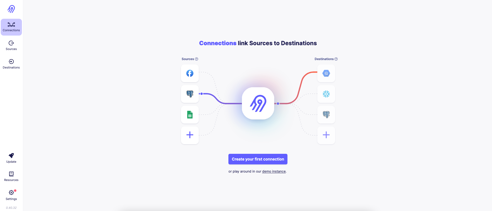

## 4. Configure Data Pipelines

1. Configure Postgres Source

    Get database credentials: https://github.com/kzzzr/mybi-dbt-showcase/blob/main/dbt_project.yml#L34-L40

    ❗️ Supply JDBC URL Parameter: `prepareThreshold=0`

    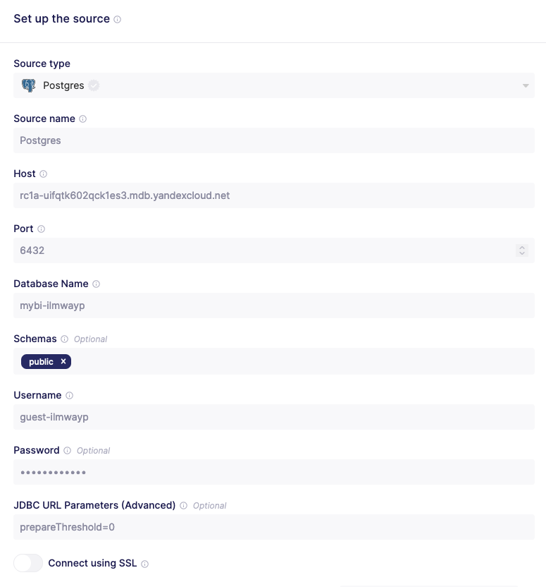

1. Configure Clickhouse Destination

    ```bash
    terraform output -raw clickhouse_host_fqdn
    ```

    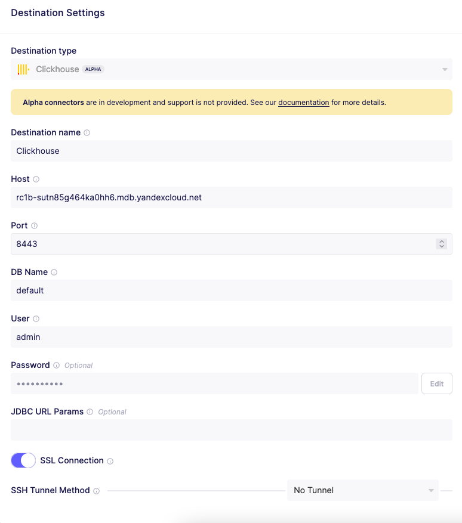

1. Configure S3 Destination

    Gather Object Storage Bucket name and a pair of keys:

    ```bash
    export S3_BUCKET_NAME=$(terraform output -raw yandex_storage_bucket_name)
    export S3_ACCESS_KEY=$(terraform output -raw yandex_iam_service_account_static_access_key)
    export S3_SECRET_KEY=$(terraform output -raw yandex_iam_service_account_static_secret_key)

    echo $S3_BUCKET_NAME
    echo $S3_ACCESS_KEY
    echo $S3_SECRET_KEY
    ```

    ❗️ Make sure you configure settings properly:
    
    - Set `s3_bucket_path` to `mybi`
    - Set endpoint to `storage.yandexcloud.net`

    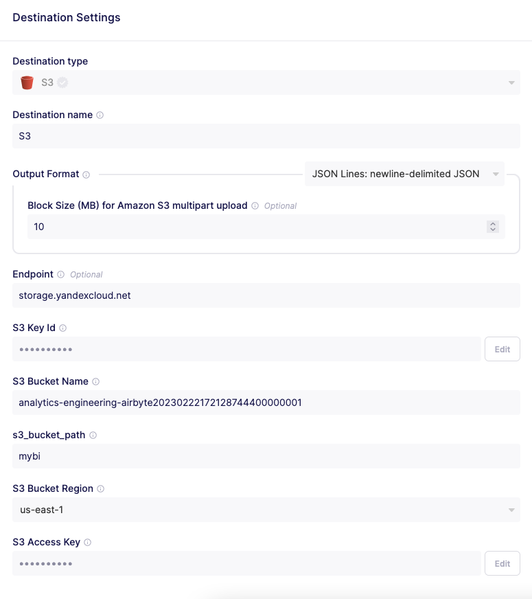

    ❗️ Set Destination Connector S3 version to `0.1.16`. Otherwise you will get errors with Yandex.Cloud Object Storage.

    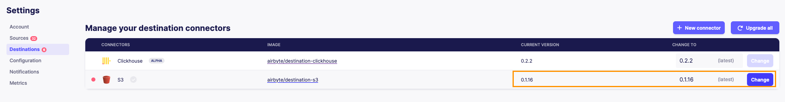

1. Sync data to Clickhouse Destination

    Only sync tables with `general_` prefix.

    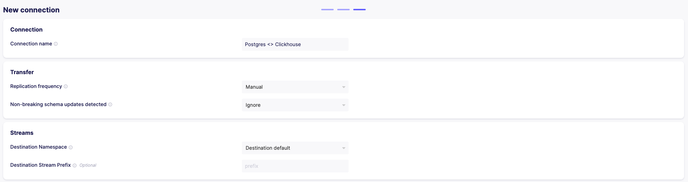
    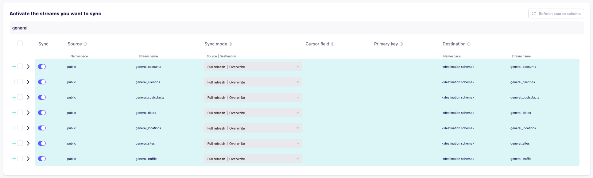
    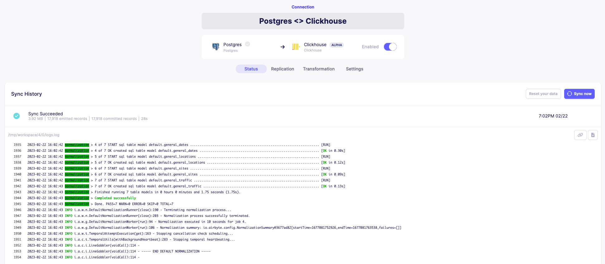

1. Sync data to S3 Destination

    Only sync tables with `general_` prefix.

    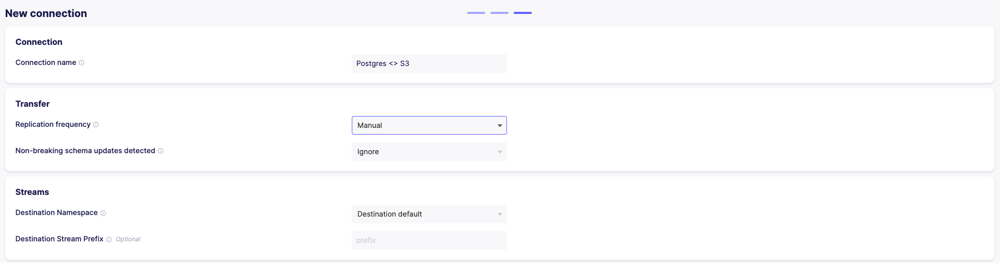
    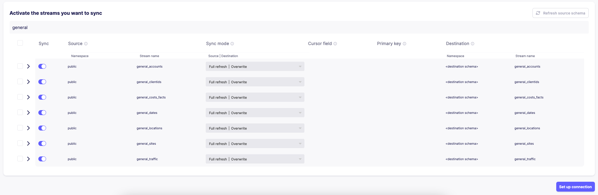
    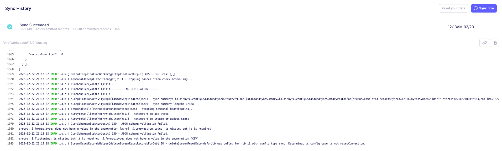

## 5. Test your Pipeline with dbt

1. First run tests with your own created Clickhouse cluster

Since you have synced data to S3 bucket with public access, this data now should be available with Clickhouse [s3 table engine](https://clickhouse.com/docs/en/engines/table-engines/integrations/s3)

Export variables to allow connection to Clickhouse in your Cloud:

```bash
export CLICKHOUSE_HOST=$(terraform output -raw clickhouse_host_fqdn)
export DBT_HOST=${CLICKHOUSE_HOST}
export DBT_USER=${CLICKHOUSE_USER}
export DBT_PASSWORD=${TF_VAR_clickhouse_password}
```

Make sure it works:

```bash
dbt debug
dbt build
```

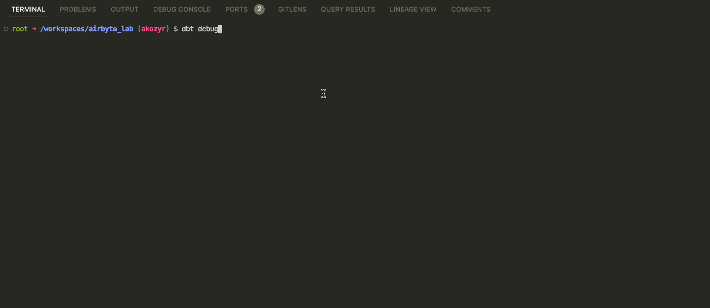

2. If it works for you, open PR and trigger automated testing with Github Actions

- ❗️ Fill in your own bucket name to [.github/workflows/ci.yml](./.github/workflows/ci.yml#L58)
- Submit your Pull Request

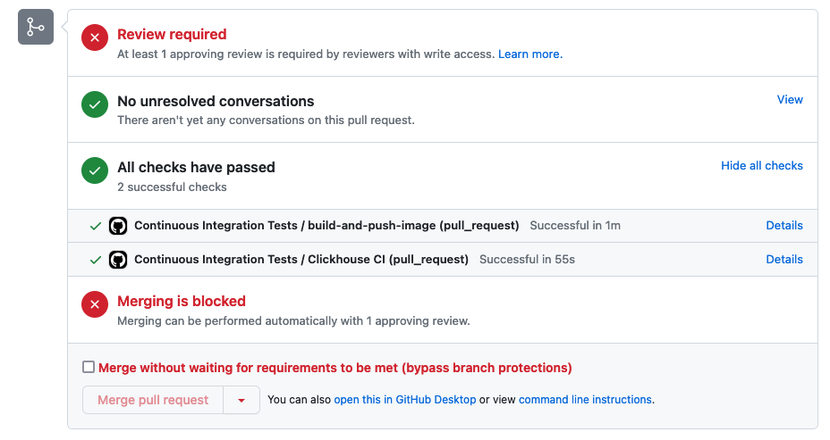

## Delete cloud resources

⚠️ Attention! Always delete cloud resources after you finished!


```bash
terraform destroy
```
